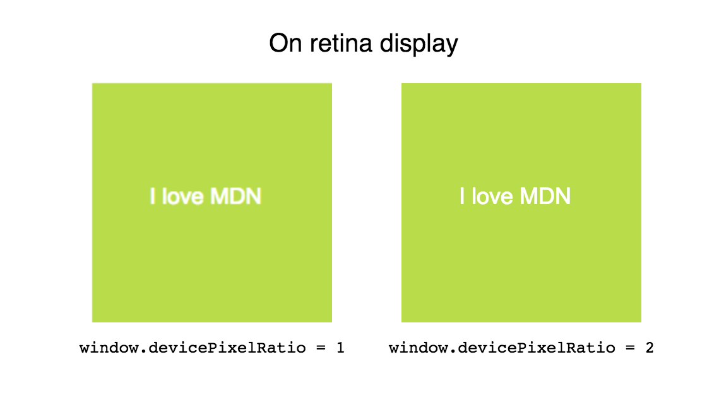
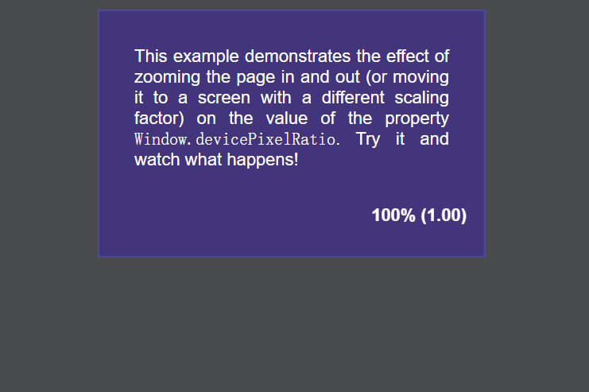

# [devicePixelRatio](https://developer.mozilla.org/zh-CN/docs/Web/API/Window/devicePixelRatio)

> - `Window` 接口的 `devicePixelRatio` 返回当前显示设备的物理像素分辨率与CSS 像素分辨率之比。
> - 可解释为像素大小的比率：一个 CSS 像素的大小与一个物理像素的大小。简单来说，它告诉浏览器应使用多少屏幕实际像素来绘制单个 CSS 像素
>
> - 当处理标准显示器与 HiDPI 或 Retina 显示器之间的差异时，这很有用，后者使用更多的屏幕像素绘制相同的对象，从而获得更清晰的图像
>
> - 可以使用`window.matchMedia()` 检查`devicePixelRatio`的值是否发生更改（例如，如果用户将窗口拖动到带有 不同的像素密度）

```js
value = window.devicePixelRatio
```

## 值 Value

一个双精度浮点值，指示显示器的物理像素分辨率与 CSS 像素分辨率之比

- 值 1 表示经典 96 DPI（在某些平台上为 76 DPI）显示
- 对于 HiDPI / Retina 显示屏则期望值为 2。在异常低分辨率的显示器中
- 当屏幕的像素深度比简单地将 96 或 76 DPI 的标准分辨率提高一倍时，可能还会返回其他值。

## 在 `<canvas>` 中更正分辨率

> `<canvas>`可能在视网膜屏幕上显得太模糊
> 使用`window.devicePixelRatio`确定应添加多少额外的像素密度以使图像更清晰

```html
<canvas id="canvas"></canvas>
```

```js
 var canvas = document.getElementById('canvas');
var ctx = canvas.getContext('2d');

// Set display size (css pixels).
var size = 200;
canvas.style.width = size + "px";
canvas.style.height = size + "px";

// Set actual size in memory (scaled to account for extra pixel density).
var scale = window.devicePixelRatio; // Change to 1 on retina screens to see blurry canvas.
canvas.width = Math.floor(size *scale);
canvas.height = Math.floor(size* scale);

// Normalize coordinate system to use css pixels.
ctx.scale(scale, scale);

ctx.fillStyle = "#bada55";
ctx.fillRect(10, 10, 300, 300);
ctx.fillStyle = "#ffffff";
ctx.font = '18px Arial';
ctx.textAlign = 'center';
ctx.textBaseline = 'middle';

var x = size / 2;
var y = size / 2;

var textString = "I love MDN";
ctx.fillText(textString, x, y);
```



## 监视屏幕分辨率或缩放级别的更改

> 在此示例中，我们将设置一个媒体查询并观看它以查看设备分辨率何时更改，以便我们可以检查`devicePixelRatio`的值来处理所需的任何更新

> JavaScript 代码创建媒体查询，以监控设备分辨率并在每次更改时检查`devicePixelRatio`的值

```js
let pixelRatioBox = document.querySelector(".pixel-ratio");
let mqString = `(resolution: ${window.devicePixelRatio}dppx)`;

const updatePixelRatio = () => {
  let pr = window.devicePixelRatio;
  let prString = (pr * 100).toFixed(0);
  pixelRatioBox.innerText = `${prString}% (${pr.toFixed(2)})`;
}

updatePixelRatio();

matchMedia(mqString).addListener(updatePixelRatio)
```

> 字符串`mqString`设置为媒体查询本身。媒体查询以`(resolution: 1dppx)`（对于标准显示）或`(resolution: 2dppx)`（对于 `Retina` / `HiDPI` 显示）开始，检查当前显示分辨率是否与每个像素px的实际设备像素点匹配

> `updatePixelRatio()`函数获取`devicePixelRatio`的当前值，然后将`pixelRatioBox`的 `innerText`设置为一个字符串，该字符串同时显示百分比和原始十进制值比率，最多两位小数

> 调用`updatePixelRatio()`函数一次以显示起始值，然后使用`matchMedia()` 和 `addEventListener()`来将updatePixelRatio()设置为change事件的处理程序

> HTML 将创建包含说明的框和将显示当前像素比率信息的pixel-ratio 框。

```html
<div class="container">
  <div class="inner-container">
    <p>This example demonstrates the effect of zooming the page in
       and out (or moving it to a screen with a different scaling
       factor) on the value of the property <code>Window.devicePixelRatio</code>.
       Try it and watch what happens!</p>
  </div>
    <div class="pixel-ratio"></div>
</div>
```

```css
body {
  font: 22px arial, sans-serif;
}

.container {
  top: 2em;
  width: 22em;
  height: 14em;
  border: 2px solid #22d;
  margin: 0 auto;
  padding: 0;
  background-color: #a9f;
}

.inner-container {
  padding: 1em 2em;
  text-align: justify;
  text-justify: auto;
}

.pixel-ratio {
  position: relative;
  margin: auto;
  height: 1.2em;
  text-align: right;
  bottom: 0;
  right: 1em;
  font-weight: bold;
}
```


> > `devicePixelRatio`=1 时候
