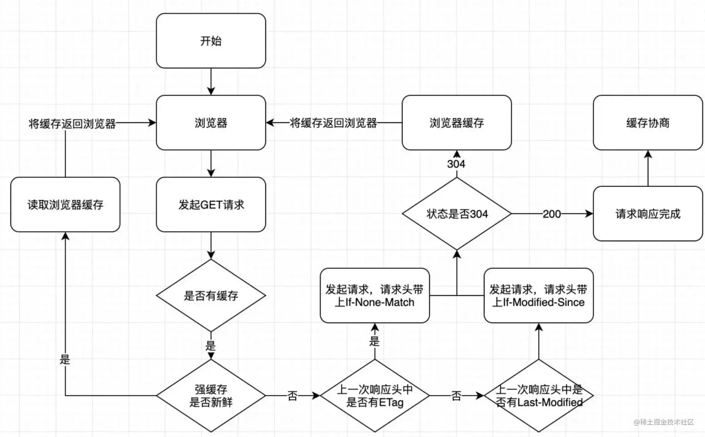

# http 缓存

## 分类

> `强制缓存` 和 `协商缓存`



## 强缓存

> 强制缓存

### `Expires`


> - `Expires`字段的作用是，设定一个强缓存时间。在此时间范围内，则从内存（或磁盘）中读取缓存返回。
>   - 比如说将某一资源设置响应头为:`Expires:new Date("2022-7-30 23:59:59")`
那么，该资源在`2022-7-30 23:59:59` 之前，都会去本地的磁盘（或内存）中读取，不会去服务器请求
但是，Expires已经被废弃了。对于强缓存来说，Expires已经不是实现强缓存的首选
> - `Expires`判断强缓存是否过期的机制是:获取本地时间戳，并对先前拿到的资源文件中的`Expires`字段的时间做比较。来判断是否需要对服务器发起请求。这里有一个巨大的漏洞：“如果我本地时间不准咋办？”
> `Expires`过度依赖本地时间，如果本地与服务器时间不同步，就会出现资源无法被缓存或者资源永远被缓存的情况。所以，`Expires`字段几乎不被使用了。现在的项目中，我们并不推荐使用`Expires`，强缓存功能通常使用`cache-control`字段来代替`Expires`字段

### `Cache-control`

> 替代`Expires`的强缓存实现方法
> `Cache-control`这个字段在`http1.1`中被增加，`Cache-control`完美解决了Expires本地时间和服务器时间不同步的问题。是当下的项目中实现强缓存的最常规方法。
> `Cache-control`的使用方法页很简单，只要在资源的响应头上写上需要缓存多久就好了，单位是秒

```js
//往响应头中写入需要缓存的时间
res.writeHead(200,{
  'Cache-Control':'max-age=10'
});
```

> 在该资源第一次返回的时候开始, 往后10秒内, 如果该资源背再次请求, 则从缓存中读取


`Cache-Control`:

- `max-age=N`: `N`就是需要缓存的秒数, 从第一次请求资源开始, 往后N秒内, 资源若再次请求, 则直接从磁盘(或内存中读取), 不与服务器交互
- `max-age`: 决定客户端资源被缓存多久
- `s-maxage`: 决定代理服务器缓存的时长
- `no-cache` : 强制进行协商缓存
- `no-store` : 禁止任何缓存策略
- `public` : 资源即可以被浏览器缓存也可以被代理服务器缓存
- `private` : 资源只能被浏览器缓存

补充:

- `no-cache` 和 `no-store` 为互斥属性, 不可同时出现在`Cache-Control`中

#### `public` 和 `private`

> 一般请求


> 出现代理服务器


`public`: 表示资源在客户端和代理服务器都可以被缓存
`private`:

- 表示资源只能在客户端被缓存, 拒绝资源在代理服务器缓存
- 两值没有设置, 默认是`private`
