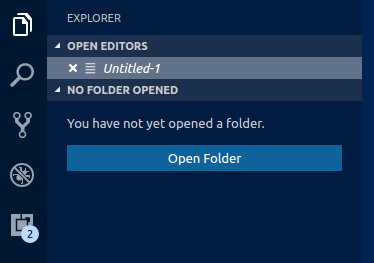
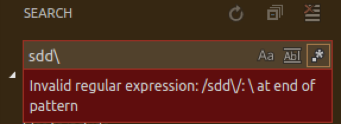
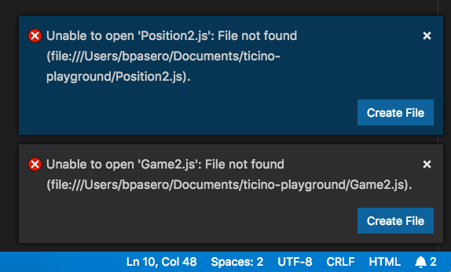
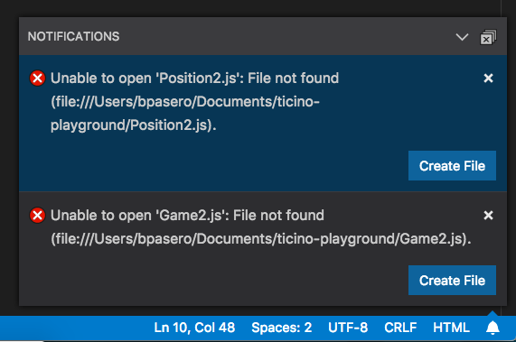

# [`主题颜色`](https://code.visualstudio.com/api/references/theme-color)

> 使用用户设置自定义活动的 Visual Studio Code颜色主题。`workbench.colorCustomizations`
> 翻译时间: `2022-11-22 17:29:11`

```js
{
  "workbench.colorCustomizations": {
    "activityBar.background": "#00AA00"
  }
}
```

> 注意:如果要使用现有颜色主题，请参阅颜色主题，您将了解如何通过“首选项:颜色主题”下拉列表（`Ctrl+K` `Ctrl+T`）设置活动颜色主题。

> 主题颜色在Web 视图中可用作 CSS 变量，并且有一个扩展可用于为它们提供智能感知。

## 颜色格式

> - 可以在 RGB 颜色模型中定义颜色值，并使用 Alpha 通道实现透明度。作为格式，支持以下十六进制表示法:`#RGB`，`#RGBA`，和 `#RRGGBBAA`。 R（红色）、G（绿色）、B（蓝色）和 A（字母）是十六进制字符（0-9、a-f 或 A-F）。三位表示法 （） 是六位形式 （） 的较短版本，四位 RGB 表示法 （） 是八位形式 （） 的较短版本。例如是相同的颜色。#RGB #RGBA #RRGGBB #RRGGBBAA #RGB #RRGGBB #RGBA #RRGGBBAA #e35f #ee3355ff
> - 如果未定义 alpha 值，则默认为（不透明，无透明度）。如果设置为 alpha，则颜色完全透明。ff00
> - 某些颜色不应不透明，以免覆盖其他注释。检查颜色说明以查看适用于哪些颜色

## 对比色

对比度颜色通常仅针对高对比度主题设置。如果设置，它们会在 UI 中的项目周围添加额外的边框以增加对比度。

contrastActiveBorder:活动元素周围多出边框，将它们与其他元素分开，对比度更高。
contrastBorder:元素周围有额外的边框，以将它们与其他元素分开，以获得更大的对比度。

## 基色

- `focusBorder`: 聚焦元素的整体边框颜色。仅当未被组件覆盖时，才使用此颜色
- `foreground`: 整体前景色。仅当未被组件覆盖时，才使用此颜色
- `disabledForeground`: 禁用元素的整体前景。仅当未被组件覆盖时，才使用此颜色
- `widget.shadow`: 编辑器中的查找/替换等小部件的阴影颜色
- `selection.background`: 工作台中文本选择的背景色（对于输入字段或文本区域，不适用于编辑器和终端中的选择）
- `descriptionForeground`: 说明文本的前景色，提供附加信息，例如标签
- `errorForeground`: 错误消息的整体前景色（仅当未被组件覆盖时才使用此颜色）
- `icon.foreground`: 工作台中图标的默认颜色
- `sash.hoverBorder`: 可拖动窗框的悬停边框颜色

## 窗口边框

> VS Code 窗口边框的主题颜色。

- `window.activeBorder`: 活动（焦点）窗口的边框颜色。
- `window.inactiveBorder`: 非活动（未聚焦）窗口的边框颜色。

## 文本颜色

> 文本文档中的颜色，例如欢迎页面

- `textBlockQuote.background`: 文本中块引用的背景颜色
- `textBlockQuote.border`: 文本中块引号的边框颜色
- `textCodeBlock.background`: 文本中代码块的背景色
- `textLink.activeForeground`: 单击鼠标悬停时文本中链接的前景色
- `textLink.foreground`: 文本中链接的前景色
- `textPreformat.foreground`: 预设格式的文本段的前景色
- `textSeparator.foreground`: 文本分隔符的颜色

## 动作色

> 一组颜色，用于控制与整个工作台上的操作的交互

- `toolbar.hoverBackground`: 使用鼠标将鼠标悬停在操作上时的工具栏背景
- `toolbar.hoverOutline`: 使用鼠标将鼠标悬停在操作上时的工具栏轮廓
- `toolbar.activeBackground`: 将鼠标悬停在操作上时的工具栏背景

## 按钮控制

> 按钮微件的一组颜色，例如新窗口资源管理器中的“打开文件夹”按钮



- `button.background`:按钮背景色
- `button.foreground`:按钮前景色
- `button.border`:按钮边框颜色
- `button.separator`:按钮分隔符颜色
- `button.hoverBackground`:悬停时按钮背景色
- `button.secondaryForeground`:辅助按钮前景色
- `button.secondaryBackground`:辅助按钮背景色
- `button.secondaryHoverBackground`:悬停时辅助按钮背景色
- `checkbox.background`:复选框小部件的背景颜色
- `checkbox.foreground`:复选框构件的前景色
- `checkbox.border`:复选框构件的边框颜色

## 下拉控件

> 所有下拉构件（例如在“集成终端”或“输出”面板中）的一组颜色。请注意， 下拉控件目前未在 macOS 上使用


- `dropdown.background`:下拉背景
- `dropdown.listBackground`:下拉列表背景
- `dropdown.border`:下拉边框
- `dropdown.foreground`:下拉前景

## 输入控制

> 输入控件的颜色，例如在“搜索”视图或“查找/替换”对话框中



- `input.background`:输入框背景
- `input.border`:输入框边框
- `input.foreground`:输入框前景
- `input.placeholderForeground`:占位符文本的输入框前景色
- `inputOption.activeBackground`:输入字段中已激活选项的背景颜色
- `inputOption.activeBorder`:输入字段中已激活选项的边框颜色
- `inputOption.activeForeground`:输入字段中已激活选项的前景色
- `inputOption.hoverBackground`:输入字段中已激活选项的背景颜色
- `inputValidation.errorBackground`:输入错误严重性的验证背景颜色
- `inputValidation.errorForeground`:输入错误严重性的验证前景色
- `inputValidation.errorBorder`:输入错误严重性的验证边框颜色
- `inputValidation.infoBackground`:输入信息严重性的验证背景颜色
- `inputValidation.infoForeground`:输入信息严重性的验证前景色
- `inputValidation.infoBorder`:输入信息严重性的验证边框颜色
- `inputValidation.warningBackground`:输入信息警告的验证背景颜色
- `inputValidation.warningForeground`:输入验证前景色以表示警告严重性
- `inputValidation.warningBorder`:输入警告严重性的验证边框颜色

## 滚动条控件

- `scrollbar.shadow`:滚动条滑块阴影，指示视图已滚动
- `scrollbarSlider.activeBackground`:单击时滚动条滑块背景颜色
- `scrollbarSlider.background`:滚动条滑块背景色
- `scrollbarSlider.hoverBackground`:悬停时滚动条滑块背景色

## 徽章

> 徽章是小信息标签，例如搜索结果计数

- `badge.foreground`:徽章前景色
- `badge.background`:徽章背景颜色

## 进度条

`progressBar.background`: 长时间运行的操作显示的进度条的背景色

## 列表和树

> 列表和树的颜色**，如文件资源管理器。活动列表/树具有键盘焦点，非活动列表/树没有

- `list.activeSelectionBackground`: 列表/树处于活动状态时所选项目的列表/树背景色
- `list.activeSelectionForeground`: 列表/树处于活动状态时所选项目的列表/树前景色
- `list.activeSelectionIconForeground`: 列表/树处于活动状态时所选项目的列表/树图标前景色。活动列表/树具有键盘焦点，非活动列表/树没有
- `list.dropBackground`: 使用鼠标移动项目时列表/树拖放背景
- `list.focusBackground`: 列表/树处于活动状态时焦点项目的列表/树背景颜色
- `list.focusForeground`: 列表/树处于活动状态时焦点项目的列表/树前景色。活动列表/树具有键盘焦点，非活动列表/树没有
- `list.focusHighlightForeground`: 在列表/树内搜索时，匹配项的列表/树前景色会突出显示活动焦点项目
- `list.focusOutline`: 列表/树处于活动状态时焦点项目的列表/树轮廓颜色。活动列表/树具有键盘焦点，非活动列表/树没有
- `list.focusAndSelectionOutline`: 当列表/树处于活动状态并选择时，焦点项目的列表/树轮廓颜色。活动列表/树具有键盘焦点，非活动列表/树没有
- `list.highlightForeground`: 在列表/树内搜索时匹配突出显示的列表/树前景色
- `list.hoverBackground`: 使用鼠标将鼠标悬停在项目上时的列表/树背景
- `list.hoverForeground`: 使用鼠标将鼠标悬停在项目上时的列表/树前景
- `list.inactiveSelectionBackground`: 列表/树处于非活动状态时所选项目的列表/树背景色
- `list.inactiveSelectionForeground`: 当列表/树处于非活动状态时，所选项目的列表/树前景色。活动列表/树具有键盘焦点，非活动列表/树没有
- `list.inactiveSelectionIconForeground`: 列表/树处于非活动状态时所选项目的列表/树图标前景色。活动列表/树具有键盘焦点，非活动列表/树没有
- `list.inactiveFocusBackground`: 当列表处于非活动状态时，焦点项目的列表背景色。活动列表具有键盘焦点，非活动列表没有。目前仅在列表中受支持
- `list.inactiveFocusOutline`: 列表/树处于非活动状态时焦点项目的列表/树轮廓颜色。活动列表/树具有键盘焦点，非活动列表/树没有
- `list.invalidItemForeground`: 无效项的列表/树前景色，例如资源管理器中未解析的根
- `list.errorForeground`: 包含错误的列表项的前景色
- `list.warningForeground`: 包含警告的列表项的前景色
- `listFilterWidget.background`: 列表/树 在列表/树内搜索时过滤键入文本的背景颜色
- `listFilterWidget.outline`: 在列表/树内搜索时，列表/树过滤器小部件的键入文本的轮廓颜色
- `listFilterWidget.noMatchesOutline`: 在列表/树内搜索时未找到键入文本匹配项时的列表/树过滤器小部件的轮廓颜色
- `listFilterWidget.shadow`: 列表和树中类型过滤器小部件的缩减颜
- `list.filterMatchBackground`: 列表和树中筛选的匹配项的背景色
- `list.filterMatchBorder`: 列表和树中筛选的匹配项的边框颜色
- `list.deemphasizedForeground`: 取消强调的项目的列表/树前景色
- `tree.indentGuidesStroke`: 树构件的缩进参考线的描边颜色
- `tree.tableColumnsBorder`: 缩进参考线的树形描边颜色
- `tree.tableOddRowsBackground`: 奇数表行的背景色

## 活动栏

> 活动栏显示在工作台的最左侧或右侧，并允许在侧边栏的视图之间快速切换。

- `activityBar.background`: 活动栏背景色
- `activityBar.dropBorder`: 拖放活动栏项的反馈颜色。活动栏显示在最左侧或右侧，并允许在侧边栏的视图之间切换
- `activityBar.foreground`: 活动栏前景色（例如用于图标）
- `activityBar.inactiveForeground`: 活动栏项目处于非活动状态时的前景色
- `activityBar.border`: 活动栏边框颜色与侧边栏
- `activityBarBadge.background`: 活动通知徽章背景颜色
- `activityBarBadge.foreground`: 活动通知徽章前景色
- `activityBar.activeBorder`: 活动栏活动指示器边框颜色
- `activityBar.activeBackground`: 活动元素的活动栏可选背景色
- `activityBar.activeFocusBorder`: 活动项的活动栏焦点边框颜色
- `activityBarItem.settingsProfilesForeground`: 活动栏上设置配置文件条目的前景色
- `activityBarItem.settingsProfilesHoverForeground`: 悬停时活动栏上设置配置文件条目的前景色
- `activityBarItem.settingsProfilesBackground`: 活动栏上设置配置文件条目的背景色

## 侧边栏

> 侧边栏包含资源管理器和搜索等视图

- `sideBar.background`: 侧边栏背景颜色
- `sideBar.foreground`: 侧边栏前景色。侧边栏是资源管理器和搜索等视图的容器
- `sideBar.border`: 分隔编辑器一侧的侧边栏边框颜色
- `sideBar.dropBackground`: 拖放侧边栏部分的反馈颜色。颜色应具有透明度，以便侧边栏部分仍然可以发光
- `sideBarTitle.foreground`: 侧边栏标题前景色
- `sideBarSectionHeader.background`: 侧边栏部分标题背景颜色
- `sideBarSectionHeader.foreground`: 侧边栏部分标题前景色
- `sideBarSectionHeader.border`: 侧边栏部分标题边框颜色

## 小地图

> 小地图显示当前文件的缩小版本

- `minimap.findMatchHighlight`: 突出显示文件中搜索的匹配项的颜色
- `minimap.selectionHighlight`: 编辑器选择的高亮颜色
- `minimap.errorHighlight`: 突出显示编辑器中错误的颜色
- `minimap.warningHighlight`: 在编辑器中突出显示警告的颜色
- `minimap.background`: 小地图背景颜色
- `minimap.selectionOccurrenceHighlight`: 用于重复编辑器选择的小地图标记颜色
- `minimap.foregroundOpacity`: 小地图中渲染的前景元素的不透明度。例如，“#000000c0”将以 75% 的不透明度呈现元素
- `minimapSlider.background`: 小地图滑块背景色
- `minimapSlider.hoverBackground`: 悬停时的小地图滑块背景色
- `minimapSlider.activeBackground`: 点击时的小地图滑块背景色
- `minimapGutter.addedBackground`: 添加内容的小地图装订线颜色
- `minimapGutter.modifiedBackground`: 修改内容的小地图装订线颜色
- `minimapGutter.deletedBackground`: 已删除内容的小地图装订线颜色

## 编辑器组和选项卡

> 编辑器组是编辑器的容器。可以有许多编辑器组。选项卡是编辑器的容器。可以在一个编辑器组中打开多个选项卡

编辑器组是编辑器的容器。可以有许多编辑器组。选项卡是编辑器的容器。可以在一个编辑器组中打开多个选项卡。

- `editorGroup.border`: 用于分隔多个编辑器组的颜色
  - 
- `editorGroup.dropBackground`: 拖动编辑器时的背景色
  - 
- `editorGroupHeader.noTabsBackground`: 禁用选项卡（设置）时编辑器组标题标题的背景色。`"workbench.editor.showTabs": false`
  - 

- `editorGroupHeader.tabsBackground`: 选项卡容器的背景色
  - 
- `editorGroupHeader.tabsBorder`: 启用选项卡时编辑器选项卡控件下方的边框颜色
  - 

- `editorGroupHeader.border`: 编辑器组标题和编辑器之间的边框颜色（如果启用，则位于痕迹导航下方）
- `editorGroup.emptyBackground`: 空编辑器组的背景色
- `editorGroup.focusedEmptyBorder`: 获得焦点的空编辑器组的边框颜色
- `editorGroup.dropIntoPromptForeground`: 拖动文件时在编辑器上显示的文本的前景色。此文本通知用户可以按住 shift 键放入编辑器
- `editorGroup.dropIntoPromptBackground`: 拖动文件时在编辑器上显示的文本的背景色。此文本通知用户可以按住 shift 键放入编辑器
- `editorGroup.dropIntoPromptBorder`: 拖动文件时在编辑器上显示的文本的边框颜色。此文本通知用户可以按住 shift 键放入编辑器
- `tab.activeBackground`: 活动组中的活动选项卡背景色
- `tab.unfocusedActiveBackground`: 非活动编辑器组中的活动选项卡背景色
- `tab.activeForeground`: 活动组中的活动制表符前景色
- `tab.border`: 用于分隔制表符的边框
- `tab.activeBorder`: 活动选项卡的下边框
- `tab.unfocusedActiveBorder`: 非活动编辑器组中活动选项卡的下边框
- `tab.activeBorderTop`: 活动选项卡的上边框
- `tab.unfocusedActiveBorderTop`: 非活动编辑器组中活动选项卡的上边
- `tab.lastPinnedBorder`: 最后一个固定编辑器右侧的边框，用于与未固定的编辑器分开
- `tab.inactiveBackground`: 非活动选项卡背景色
- `tab.unfocusedInactiveBackground`: 非焦点组中的非活动选项卡背景
- `tab.inactiveForeground`: 活动组中的非活动制表符前景色
- `tab.unfocusedActiveForeground`: 非活动编辑器组中的活动选项卡前景色
- `tab.unfocusedInactiveForeground`: 非活动编辑器组中的非活动制表前景色
- `tab.hoverBackground`: 悬停时选项卡背景颜
- `tab.unfocusedHoverBackground`: 悬停时未聚焦组中的选项卡背景
- `tab.hoverForeground`: 悬停时选项卡前景
- `tab.unfocusedHoverForeground`: 悬停时在未对焦的组中使用前景色选项
- `tab.hoverBorder`: 悬停时突出显示标签页的边
- `tab.unfocusedHoverBorder`: 悬停时突出显示未聚焦组中的选项卡的边
- `tab.activeModifiedBorder`: 活动组中已修改（dirty）活动选项卡顶部的边框
- `tab.inactiveModifiedBorder`: 活动组中已修改（dirty）非活动选项卡顶部的边框
- `tab.unfocusedActiveModifiedBorder`: 未聚焦组中已修改（dirty）活动选项卡顶部的边框
- `tab.unfocusedInactiveModifiedBorder`: 未聚焦组中已修改（dirty）非活动选项卡顶部的边框
- `editorPane.background`: 编辑器窗格的背景色在居中的编辑器布局的左侧和右侧可见
- `sideBySideEditor.horizontalBorder`: 在编辑器组中从上到下并排显示时，用于将两个编辑器彼此分开的颜色
- `sideBySideEditor.verticalBorder`: 在编辑器组中从左到右并排显示时，用于将两个编辑器彼此分开的颜色

## 编辑器颜色

> 最突出的编辑器颜色是用于语法突出显示的标记颜色，并且基于安装的语言语法。这些颜色由颜色主题定义，但也可以使用设置进行自定义。有关更新颜色主题和可用令牌类型的详细信息，请参阅[自定义颜色主题](https://code.visualstudio.com/docs/getstarted/themes#_customizing-a-color-theme)。``editor.tokenColorCustomizations`

### 所有其他编辑器颜色

- `editor.background`: 编辑器背景色
- `editor.foreground`: 编辑器默认前景色
- `editorLineNumber.foreground`: 编辑器行号的颜色
- `editorLineNumber.activeForeground`: 活动编辑器行号的颜色
- `editorCursor.background`: 编辑器光标的背景色。允许自定义块光标重叠的字符的颜色
- `editorCursor.foreground`: 编辑器光标的颜色

### 选中高亮

> 选择一个或多个字符时，选择颜色可见。除了选择之外，还会突出显示具有相同内容的所有区域。


- `editor.selectionBackground`: 编辑器选择的颜色
- `editor.selectionForeground`: 所选文本的颜色以获得高对比度
- `editor.inactiveSelectionBackground`: 非活动编辑器中所选内容的颜色。颜色不得不透明，以免隐藏底层装饰
- `editor.selectionHighlightBackground`: 与所选内容相同的区域的颜色。颜色不得不透明，以免隐藏底层装饰
- `editor.selectionHighlightBorder`: 与所选内容相同的区域的边框颜色
  
### 选中单词高亮

> 当光标位于符号或单词内时，单词突出显示颜色可见。根据文件类型可用的语言支持，将突出显示所有匹配的引用和声明，并且读取和写入访问将获得不同的颜色。如果文档符号语言支持不可用，则回退到单词突出显示。


- `editor.wordHighlightBackground`: 读取访问期间符号的背景颜色，例如读取变量时。颜色不得不透明，以免隐藏底层装饰
- `editor.wordHighlightBorder`: 读取访问期间符号的边框颜色，例如读取变量时
- `editor.wordHighlightStrongBackground`: 写入访问期间符号的背景颜色，例如写入变量时。颜色不得不透明，以免隐藏底层装饰
- `editor.wordHighlightStrongBorder`: 写入访问期间符号的边框颜色，例如写入变量时

### 查找高亮

> 查找颜色取决于“查找/替换”对话框中的当前查找字符串


- `editor.findMatchBackground`: 当前搜索匹配项的颜色
- `editor.findMatchHighlightBackground`: 其他搜索匹配项的颜色。颜色不得不透明，以免隐藏底层装饰
- `editor.findRangeHighlightBackground`: 为限制搜索的范围着色（在查找小部件中启用“在所选内容中查找”）。颜色不得不透明，以免隐藏底层装饰
- `editor.findMatchBorder`: 当前搜索匹配项的边框颜色
- `editor.findMatchHighlightBorder`: 其他搜索匹配项的边框颜色
- `editor.findRangeHighlightBorder`: 边框颜色限制搜索的范围（在查找小部件中启用“在选择中查找”）

### 搜索编辑器

> 搜索编辑器颜色突出显示搜索编辑器中的结果。这可以与其他查找匹配项分开配置，以便在同一编辑器中更好地区分不同类别的匹配项。


- `searchEditor.findMatchBackground`: 编辑器结果的颜色
- `searchEditor.findMatchBorder`: 编辑器结果的边框颜色
- `searchEditor.textInputBorder`: 搜索编辑器文本输入框边框

### 悬浮高亮

> 悬停高亮显示显示在显示悬停的符号后面


- `editor.hoverHighlightBackground`: 突出显示显示悬停的字词下方。颜色不得不透明，以免隐藏底层装饰

> 当前线条通常显示为背景突出显示或边框（而不是两者）。


- `editor.lineHighlightBackground`: 光标位置处线条高亮显示的背景色
- `editor.lineHighlightBorder`: 光标位置处线条周围边框的背景色

> 统一码突出显示的颜色

- `editorUnicodeHighlight.border`: 用于突出显示 unicode 字符的边框颜色
- `editorUnicodeHighlight.background`: 用于突出显示 unicode 字符的背景色

> 单击链接时，链接颜色可见


`editorLink.activeForeground`: 活动链接的颜色

> 选择搜索结果时，范围突出显示可见


- `editor.rangeHighlightBackground`: 突出显示范围的背景色，由“快速打开”、“文件中的符号”和“查找”功能使用。颜色不得不透明，以免隐藏底层装饰
- `editor.rangeHighlightBorder`: 突出显示范围周围边框的背景色

> 通过诸如“转至定义”等命令导航到符号时，符号高亮显示可见

- `editor.symbolHighlightBackground`: 突出显示符号的背景颜色。颜色不得不透明，以免隐藏底层装饰
- `editor.symbolHighlightBorder`: 突出显示的符号周围边框的背景色

> 要查看编辑器空白，请启用切换渲染空白。

- `editorWhitespace.foreground`: 编辑器中空格字符的颜色

> 要查看编辑器缩进指南，请设置。"editor.guides.indentation": true"editor.guides.highlightActiveIndentation": true

- `editorIndentGuide.background`:编辑器缩进参考线的颜色
- `editorIndentGuide.activeBackground`:活动编辑器缩进参考线的颜色

> 要查看编辑器内联提示，请设置。"editor.inlineSuggest.enabled": true

- `editorInlayHint.background`: 内联提示的背景色
- `editorInlayHint.foreground`: 内联提示的前景色
- `editorInlayHint.typeForeground`: 类型的内联提示的前景色
- `editorInlayHint.typeBackground`: 类型的内联提示的背景色
- `editorInlayHint.parameterForeground`: 参数内联提示的前景色
- `editorInlayHint.parameterBackground`: 参数内联提示的背景色

> 要查看编辑器标尺，请使用"editor.rulers"

- `editorRuler.foreground`: 编辑器标尺的颜色

- `editor.linkedEditingBackground`: 编辑器处于链接编辑模式时的背景颜色

代码镜头:


- `editorCodeLens.foreground`: 编辑器代码镜头的前景色

灯泡:

`editorLightBulb.foreground`:用于灯泡操作图标的颜色
`editorLightBulbAutoFix.foreground`:用于灯泡自动修复操作图标的颜色

### 括号颜色


- `editorBracketMatch.background`: 匹配括号后面的背景色
- `editorBracketMatch.border`: 匹配括号框的颜色

#### 支架对着色

- `editorBracketHighlight.foreground1`: 括号 （1） 的前景色。需要启用括号对着色
- `editorBracketHighlight.foreground2`: 括号 （2） 的前景色。需要启用括号对着色
- `editorBracketHighlight.foreground3`: 括号 （3） 的前景色。需要启用括号对着色
- `editorBracketHighlight.foreground4`: 括号（4）的前景色。需要启用括号对着色
- `editorBracketHighlight.foreground5`: 括号 （5） 的前景色。需要启用括号对着色
- `editorBracketHighlight.foreground6`: 方括号（6）的前景色。需要启用括号对着色
- `editorBracketHighlight.unexpectedBracket.foreground`: 意外括号的前景色

#### 支架对导轨

- `editorBracketPairGuide.activeBackground1`: 活动支架对导轨的背景色 （1）, 需要启用支架对导轨
- `editorBracketPairGuide.activeBackground2`: 活动支架对导轨的背景色 （2）, 需要启用支架对导轨
- `editorBracketPairGuide.activeBackground3`: 主动支架对导轨的背景色 （3）, 需要启用支架对导轨
- `editorBracketPairGuide.activeBackground4`: 活动支架对导轨的背景色 （4）, 需要启用支架对导轨
- `editorBracketPairGuide.activeBackground5`: 活动支架对导轨的背景色 （5）, 需要启用支架对导轨
- `editorBracketPairGuide.activeBackground6`: 活动支架对导轨的背景色 （6）, 需要启用支架对导轨
- `editorBracketPairGuide.background1`: 非活动支架对导轨的背景颜色 （1）, 需要启用支架对导轨
- `editorBracketPairGuide.background2`: 非活动支架对导轨的背景颜色 （2）, 需要启用支架对导轨
- `editorBracketPairGuide.background3`: 非活动支架对导轨的背景色 （3）, 需要启用支架对导轨
- `editorBracketPairGuide.background4`: 非活动支架对导轨的背景色 （4）, 需要启用支架对导轨
- `editorBracketPairGuide.background5`: 非活动支架对导轨的背景色 （5）, 需要启用支架对导轨
- `editorBracketPairGuide.background6`: 非活动支架对导轨的背景色 （6）, 需要启用支架对导轨

#### 折叠

- `editor.foldBackground`: 折叠范围的背景色。颜色不得不透明，以免隐藏底层装饰

#### 概述标尺

> 此标尺位于编辑器右边缘的滚动条下方，用于概述编辑器中的装饰

- `editorOverviewRuler.background`: 编辑器概述标尺的背景色。仅在启用小地图并将其放置在编辑器右侧时使用
- `editorOverviewRuler.border`: 概览标尺边框的颜色
- `editorOverviewRuler.findMatchForeground`: 查找匹配项的概述标尺标记颜色。颜色不得不透明，以免隐藏底层装饰
- `editorOverviewRuler.rangeHighlightForeground`: 突出显示范围的概述标尺标记颜色，例如快速打开，文件中的符号和查找功能。颜色不得不透明，以免隐藏底层装饰
- `editorOverviewRuler.selectionHighlightForeground`: 用于选择高亮显示的概览标尺标记颜色。颜色不得不透明，以免隐藏底层装饰
- `editorOverviewRuler.wordHighlightForeground`: 符号高亮显示的概览标尺标记颜色。颜色不得不透明，以免隐藏底层装饰
- `editorOverviewRuler.wordHighlightStrongForeground`: 写入访问符号突出显示的概述标尺标记颜色。颜色不得不透明，以免隐藏底层装饰
- `editorOverviewRuler.modifiedForeground`: 已修改内容的概览标尺标记颜色
- `editorOverviewRuler.addedForeground`: 添加内容的概述标尺标记颜色
- `editorOverviewRuler.deletedForeground`: 已删除内容的概览标尺标记颜色
- `editorOverviewRuler.errorForeground`: 概述标尺标记颜色以显示错误
- `editorOverviewRuler.warningForeground`: 警告的概述标尺标记颜色
- `editorOverviewRuler.infoForeground`: 信息的概述标尺标记颜色
- `editorOverviewRuler.bracketMatchForeground`: 匹配方括号的概览标尺标记颜色

#### 错误和警告

- `editorError.foreground`: 编辑器中错误波浪线的前景色
- `editorError.border`: 编辑器中错误框的边框颜色
- `editorError.background`: 编辑器中错误文本的背景色。颜色不得不透明，以免隐藏底层装饰
- `editorWarning.foreground`: 编辑器中警告波浪线的前景色
- `editorWarning.border`: 编辑器中警告框的边框颜色
- `editorWarning.background`: 编辑器中警告文本的背景色。颜色不得不透明，以免隐藏底层装饰
- `editorInfo.foreground`: 编辑器中信息波浪线的前景色
- `editorInfo.border`: 编辑器中信息框的边框颜色
- `editorInfo.background`: 编辑器中信息文本的背景色。颜色不得不透明，以免隐藏底层装饰
- `editorHint.foreground`: 编辑器中提示的前景色
- `editorHint.border`: 编辑器中提示框的边框颜色
- `problemsErrorIcon.foreground`: 用于问题错误图标的颜色
- `problemsWarningIcon.foreground`: 用于问题警告图标的颜色
- `problemsInfoIcon.foreground`: 用于问题信息图标的颜色

#### 未使用的源代码

- `editorUnnecessaryCode.border`: 编辑器中不必要（未使用）源代码的边框颜色
- `editorUnnecessaryCode.opacity`: 编辑器中不必要（未使用）源代码的不透明度。例如，将以 75% 的不透明度呈现代码。对于高对比度主题，请使用主题颜色为不必要的代码添加下划线，而不是淡出它。``"#000000c0" "editorUnnecessaryCode.border"`

#### 装订线包含字形边距和行号

- `editorGutter.background`: 编辑器装订线的背景色。装订线包含字形边距和行号
- `editorGutter.modifiedBackground`: 已修改线条的编辑器装订线背景色
- `editorGutter.addedBackground`: 添加的线条的编辑器装订线背景色
- `editorGutter.deletedBackground`: 删除线条的编辑器装订线背景色
- `editorGutter.commentRangeForeground`: 注释范围的编辑器装订线装饰颜色
- `editorGutter.foldingControlForeground`: 编辑器装订线中折叠控件的颜色

#### 在查看拉取请求时可以看到编辑器注释小部件

- `editorCommentsWidget.resolvedBorder`: 边框和箭头的颜色，用于解决评论
- `editorCommentsWidget.unresolvedBorder`: 边框和箭头的颜色，用于未解决的评论
- `editorCommentsWidget.rangeBackground`: 注释范围的背景颜色
- `editorCommentsWidget.rangeBorder`: 注释范围的边框颜色
- `editorCommentsWidget.rangeActiveBackground`: 当前选定或悬停的评论范围的背景颜色
- `editorCommentsWidget.rangeActiveBorder`: 当前选定或悬停的注释范围的边框颜色

## 比较编辑器颜色

> 要为插入和删除的文本着色，请使用背景或边框颜色，但不能同时使用两者

- `diffEditor.insertedTextBackground`: 插入的文本的背景色。颜色不得不透明，以免隐藏底层装饰
- `diffEditor.insertedTextBorder`: 插入的文本的轮廓颜色
- `diffEditor.removedTextBackground`: 已删除文本的背景色。颜色不得不透明，以免隐藏底层装饰
- `diffEditor.removedTextBorder`: 已删除文本的轮廓颜色
- `diffEditor.border`: 两个文本编辑器之间的边框颜色
- `diffEditor.diagonalFill`: 比较编辑器对角线填充的颜色。对角线填充用于并排比较视图
- `diffEditor.insertedLineBackground`: 插入的线条的背景色。颜色不得不透明，以免隐藏底层装饰
- `diffEditor.removedLineBackground`: 已删除线条的背景色。颜色不得不透明，以免隐藏底层装饰
- `diffEditorGutter.insertedLineBackground`: 插入线条的边距的背景色
- `diffEditorGutter.removedLineBackground`: 删除线条的边距的背景色
- `diffEditorOverview.insertedForeground`: 插入内容的差异概述标尺前景
- `diffEditorOverview.removedForeground`: 已删除内容的差异概述标尺前景

### 编辑器微件颜色

> “编辑器”微件显示在编辑器内容的前面。示例包括“查找/替换”对话框、建议微件和编辑器悬停

- `editorWidget.foreground` :编辑器构件的前景色，例如查找/替换。
- `editorWidget.background` :编辑器小部件的背景色，例如查找/替换。
- `editorWidget.border` :编辑器构件的边框颜色，除非构件不包含边框或定义自己的边框颜色。
- `editorWidget.resizeBorder` :编辑器微件大小调整栏的边框颜色。仅当构件选择具有调整边框大小且颜色未被微件覆盖时，才使用颜色。
- `editorSuggestWidget.background` :建议微件的背景色。
- `editorSuggestWidget.border` :建议微件的边框颜色。
- `editorSuggestWidget.foreground` :建议微件的前景色。
- `editorSuggestWidget.focusHighlightForeground` :聚焦项目时，建议微件中突出显示的匹配颜色。
- `editorSuggestWidget.highlightForeground` :建议微件中匹配突出显示的颜色。
- `editorSuggestWidget.selectedBackground` :建议微件中所选条目的背景色。
- `editorSuggestWidget.selectedForeground` :建议构件中所选条目的前景色。
- `editorSuggestWidget.selectedIconForeground` :建议微件中所选条目的图标前景色。
- `editorSuggestWidgetStatus.foreground` :建议微件状态的前景色。
- `editorHoverWidget.foreground` :编辑器悬停的前景色。
- `editorHoverWidget.background` :编辑器悬停的背景色。
- `editorHoverWidget.border` :编辑器悬停的边框颜色。
- `editorHoverWidget.highlightForeground` :参数提示中活动项目的前景色。
- `editorHoverWidget.statusBarBackground` :编辑器悬停状态栏的背景色。
- `editorGhostText.border` :内联完成提供程序和建议预览显示的虚影文本的边框颜色。
- `editorGhostText.background` :编辑器中虚影文本的背景色。
- `editorGhostText.foreground` :内联完成提供程序和建议预览显示的虚影文本的前景色。
- `editorStickyScroll.background` :编辑器粘滞滚动背景色
- `editorStickyScrollHover.background` :悬停背景颜色上的编辑器粘滞滚动

> “调试异常”小组件是一个速览视图，当调试在异常处停止时，该视图会显示在编辑器中。

- `debugExceptionWidget.background` :异常小部件背景颜色。
- `debugExceptionWidget.border` :异常小部件边框颜色。

> 导航到编辑器中的错误和警告时会显示编辑器标记视图（转到“下一个错误”或“警告”命令）。

- `editorMarkerNavigation.background` :编辑器标记导航微件背景。
- `editorMarkerNavigationError.background` :编辑器标记导航微件错误颜色。
- `editorMarkerNavigationWarning.background` :编辑器标记导航微件警告颜色。
- `editorMarkerNavigationInfo.background` :编辑器标记导航微件信息颜色。
- `editorMarkerNavigationError.headerBackground` :编辑器标记导航小部件错误标题背景。
- `editorMarkerNavigationWarning.headerBackground` :编辑器标记导航小部件警告标题背景。
- `editorMarkerNavigationInfo.headerBackground` :编辑器标记导航微件信息标题背景。

## 速览视图颜色

> 速览视图用于将引用和声明显示为编辑器中的视图


- `peekView.border`:速览视图边框和箭头的颜色
- `peekViewEditor.background`:速览视图编辑器的背景色
- `peekViewEditorGutter.background`:速览视图编辑器中装订线的背景色
- `peekViewEditor.matchHighlightBackground`:在速览视图编辑器中匹配突出显示颜色
- `peekViewEditor.matchHighlightBorder`:匹配速览视图编辑器中的高亮边框颜色
- `peekViewResult.background`:速览视图结果列表的背景色
- `peekViewResult.fileForeground`:速览视图结果列表中文件节点的前景色
- `peekViewResult.lineForeground`:速览视图结果列表中线条节点的前景色
- `peekViewResult.matchHighlightBackground`:匹配速览视图结果列表中的突出显示颜色
- `peekViewResult.selectionBackground`:速览视图结果列表中所选条目的背景色
- `peekViewResult.selectionForeground`:速览视图结果列表中所选条目的前景色
- `peekViewTitle.background`:速览视图标题区域的背景色
- `peekViewTitleDescription.foreground`:速览视图标题信息的颜色
- `peekViewTitleLabel.foreground`:速览视图标题的颜色

## 合并冲突颜色

> 当编辑器包含特殊的差异范围时，将显示合并冲突修饰。


- `merge.currentHeaderBackground`: 内联合并冲突中的当前标头背景。颜色不得不透明，以免隐藏底层装饰
- `merge.currentContentBackground`: 内联合并冲突中的当前内容背景。颜色不得不透明，以免隐藏底层装饰
- `merge.incomingHeaderBackground`: 内联合并冲突中的传入标头背景。颜色不得不透明，以免隐藏底层装饰
- `merge.incomingContentBackground`: 内联合并冲突中的传入内容背景。颜色不得不透明，以免隐藏底层装饰
- `merge.border`: 标题上的边框颜色和内联合并中的拆分器冲突
- `merge.commonContentBackground`: 内联合并冲突中的常见祖先内容背景。颜色不得不透明，以免隐藏底层装饰
- `merge.commonHeaderBackground`: 内联合并冲突中的常见祖先标头背景。颜色不得不透明，以免隐藏底层装饰
- `editorOverviewRuler.currentContentForeground`: 内联合并冲突的当前概述标尺前景
- `editorOverviewRuler.incomingContentForeground`: 内联合并冲突的传入概述标尺前景
- `editorOverviewRuler.commonContentForeground`: 内联合并冲突的共同祖先概述标尺前景
- `mergeEditor.change.background`:更改的背景色。
- `mergeEditor.change.word.background`:单词的背景颜色发生变化。
- `mergeEditor.conflict.unhandledUnfocused.border`:未处理的未聚焦冲突的边框颜色。
- `mergeEditor.conflict.unhandledFocused.border`:未处理的焦点冲突的边框颜色。
- `mergeEditor.conflict.handledUnfocused.border`:已处理的未聚焦冲突的边框颜色。
- `mergeEditor.conflict.handledFocused.border`:已处理焦点冲突的边框颜色。
- `mergeEditor.conflict.handled.minimapOverViewRuler`:输入 1 中更改的前景色。
- `mergeEditor.conflict.unhandled.minimapOverViewRuler`:输入 1 中更改的前景色。
- `mergeEditor.conflictingLines.background`:“冲突线”文本的背景。
- `mergeEditor.changeBase.background`:基底变化的背景色。
- `mergeEditor.changeBase.word.background`:单词的背景颜色在基数中发生变化。
- `mergeEditor.conflict.input1.background`:输入 1 中装饰品的背景色。
- `mergeEditor.conflict.input2.background`:输入 2 中装饰品的背景色。

## 面板颜色

> 面板显示在编辑器区域下方，包含输出和集成终端等视图。

`panel.background`:面板背景颜色
`panel.border`:面板边框颜色，用于将面板与编辑器分开
`panel.dropBorder`:拖放面板标题的反馈颜色。面板显示在编辑器区域下方，包含输出和集成终端等视图
`panelTitle.activeBorder`:活动面板标题的边框颜色
`panelTitle.activeForeground`:活动面板的标题颜色
`panelTitle.inactiveForeground`:非活动面板的标题颜色
`panelInput.border`:面板中输入的输入框边框
`panelSection.border`:在面板中水平堆叠多个视图时使用的面板部分边框颜色。面板显示在编辑器区域下方，包含输出和集成终端等视图
`panelSection.dropBackground`:拖放面板部分的反馈颜色。颜色应具有透明度，以便面板部分仍然可以发光。面板显示在编辑器区域下方，包含输出和集成终端等视图
`panelSectionHeader.background`:面板部分标题背景颜色。面板显示在编辑器区域下方，包含输出和集成终端等视图
`panelSectionHeader.foreground`:面板部分标题前景色。面板显示在编辑器区域下方，包含输出和集成终端等视图
`panelSectionHeader.border`:在面板中垂直堆叠多个视图时使用的面板部分标题边框颜色。面板显示在编辑器区域下方，包含输出和集成终端等视图

## 状态栏颜色

> 状态栏显示在工作台的底部

- `statusBar.background`: 标准状态栏背景色
- `statusBar.foreground`: 状态栏前景色
- `statusBar.border`: 分隔状态栏和编辑器的状态栏边框颜色
- `statusBar.debuggingBackground`: 调试程序时的状态栏背景色
- `statusBar.debuggingForeground`: 调试程序时的状态栏前景色
- `statusBar.debuggingBorder`: 状态栏边框颜色，用于在调试程序时分隔状态栏和编辑器
- `statusBar.noFolderForeground`: 未打开文件夹时的状态栏前景色
- `statusBar.noFolderBackground`: 未打开文件夹时的状态栏背景色
- `statusBar.noFolderBorder`: 状态栏边框颜色，未打开文件夹时分隔状态栏和编辑器
- `statusBarItem.activeBackground`: 单击时的状态栏项目背景色
- `statusBarItem.hoverBackground`: 悬停时的状态栏项目背景色
- `statusBarItem.prominentForeground`: 状态栏突出显示项目前景色
- `statusBarItem.prominentBackground`: 状态栏突出显示项目背景色
- `statusBarItem.prominentHoverBackground`: 悬停时状态栏突出显示项目背景颜色
- `statusBarItem.remoteBackground`: 状态栏上远程指示器的背景色
- `statusBarItem.remoteForeground`: 状态栏上远程指示器的前景色
- `statusBarItem.errorBackground`: 状态栏错误项背景色。错误项从其他状态栏条目中突出显示，以指示错误条件
- `statusBarItem.errorForeground`: 状态栏错误项目前景色。错误项从其他状态栏条目中突出显示，以指示错误条件
- `statusBarItem.warningBackground`: 状态栏警告项目背景色。警告项从其他状态栏条目中突出显示，以指示警告条件。状态栏显示在窗口底部
- `statusBarItem.warningForeground`: 状态栏警告项前景色。警告项从其他状态栏条目中突出显示，以指示警告条件。状态栏显示在窗口底部
- `statusBarItem.compactHoverBackground`: 将鼠标悬停在包含两个悬停器的项目上时的状态栏项目背景色。状态栏显示在窗口底部
- `statusBarItem.focusBorder`: 聚焦于键盘导航时的状态栏项目边框颜色。状态栏显示在窗口底部
- `statusBar.focusBorder`: 聚焦于键盘导航时的状态栏边框颜色。状态栏显示在窗口底部

> 突出显示的项目从其他状态栏条目中突出显示，以指示重要性。例如，切换 Tab 键移动焦点命令更改模式指示器。

## 标题栏颜色

- `titleBar.activeBackground`: 窗口处于活动状态时的标题栏背景
- `titleBar.activeForeground`: 窗口处于活动状态时的标题栏前景
- `titleBar.inactiveBackground`: 窗口处于非活动状态时的标题栏背景
- `titleBar.inactiveForeground`: 窗口处于非活动状态时的标题栏前景
- `titleBar.border`: 标题栏边框颜色

## 菜单栏颜色

- `menubar.selectionForeground`: 菜单栏中所选菜单项的前景色
- `menubar.selectionBackground`: 菜单栏中所选菜单项的背景色
- `menubar.selectionBorder`: 菜单栏中所选菜单项的边框颜色
- `menu.foreground`: 菜单项的前景色
- `menu.background`: 菜单项的背景色
- `menu.selectionForeground`: 菜单中所选菜单项的前景色
- `menu.selectionBackground`: 菜单中所选菜单项的背景色
- `menu.selectionBorder`: 菜单中所选菜单项的边框颜色
- `menu.separatorBackground`: 菜单中分隔符菜单项的颜色
- `menu.border`: 菜单的边框颜色

## 指挥中心颜色

- `commandCenter.foreground`: 指挥中心的前景色。
- `commandCenter.activeForeground`: 指挥中心的活动前景色。
- `commandCenter.background`: 指挥中心的背景色。
- `commandCenter.activeBackground`: 指挥中心的活动背景色。
- `commandCenter.border`: 指挥中心的边框颜色。
- `commandCenter.inactiveForeground`: 窗口处于非活动状态时命令中心的前景色。
- `commandCenter.inactiveBorder`: 窗口处于非活动状态时命令中心的边框颜色。

## 通知颜色

> 通知吐司从工作台的右下角向上滑动。



在通知中心打开后，它们将显示在带有标题的列表中:



- `notificationCenter.border`: 通知中心边框颜色
- `notificationCenterHeader.foreground`: 通知中心页眉前景色
- `notificationCenterHeader.background`: 通知中心标题背景色
- `notificationToast.border`: 通知吐司边框颜色
- `notifications.foreground`: 通知前景色
- `notifications.background`: 通知背景色
- `notifications.border`: 通知边框颜色与通知中心中的其他通知分开
- `notificationLink.foreground`: 通知链接前景色
- `notificationsErrorIcon.foreground`: 用于通知错误图标的颜色
- `notificationsWarningIcon.foreground`: 用于通知警告图标的颜色
- `notificationsInfoIcon.foreground`: 用于通知信息图标的颜色

## 横幅颜色

> 横幅显示在标题栏下方，并在可见时跨越工作台的整个宽度

- `banner.background`: 横幅背景颜色
- `banner.foreground`: 横幅前景色
- `banner.iconForeground`: 横幅文本前面图标的颜色

## 扩展颜色

- `extensionButton.prominentForeground`: 扩展视图按钮前景色（例如“安装”按钮）
- `extensionButton.prominentBackground`: 扩展视图按钮背景色
- `extensionButton.prominentHoverBackground`: 扩展视图按钮背景悬停颜色
- `extensionButton.background`: 扩展操作的按钮背景色
- `extensionButton.foreground`: 扩展操作的按钮前景色
- `extensionButton.hoverBackground`: 扩展操作的按钮背景悬停颜色
- `extensionButton.separator`: 扩展操作的按钮分隔符颜色
- `extensionBadge.remoteBackground`: 扩展视图中远程徽章的背景颜色
- `extensionBadge.remoteForeground`: 扩展视图中远程锁屏提醒的前景色
- `extensionIcon.starForeground`: 扩展评级的图标颜色
- `extensionIcon.verifiedForeground`: 扩展程序验证发布者的图标颜色
- `extensionIcon.preReleaseForeground`: 预发布扩展的图标颜色
- `extensionIcon.sponsorForeground`: 扩展发起人的图标颜色

## 快速选择器颜色

- `pickerGroup.border`: 用于分组边框的快速选取器（快速打开）颜色
- `pickerGroup.foreground`: 用于标签分组的快速选取器（快速打开）颜色
- `quickInput.background`: 快速输入背景颜色。快速输入小部件是颜色主题选取器等视图的容器
- `quickInput.foreground`: 快速输入前景色。快速输入小部件是颜色主题选取器等视图的容器
- `quickInputList.focusBackground`: 焦点项目的快速选取器背景色
- `quickInputList.focusForeground`: 焦点项目的快速选取器前景色
- `quickInputList.focusIconForeground`: 焦点项目的快速选取器图标前景色
- `quickInputTitle.background`: 快速选取器标题背景颜色。快速选取器小组件是命令面板等选取器的容器

## 键绑定标签颜色

> 当存在与命令关联的键绑定时，将显示键绑定标签。可以在命令面板中看到键绑定标签的示例:


键绑定标签的用法包括（但不限于）:

- 命令面板
- 键盘快捷键编辑器
- 键盘快捷键记录器模式
- 扩展市场页面的“功能贡献”部分

以下自定义项可用:

- `keybindingLabel.background`: 键绑定标签背景颜色。键绑定标签用于表示键盘快捷键
- `keybindingLabel.foreground`: 键绑定标签前景色。键绑定标签用于表示键盘快捷键
- `keybindingLabel.border`: 键绑定标签边框颜色。键绑定标签用于表示键盘快捷键
- `keybindingLabel.bottomBorder`: 键绑定标签边框底部颜色。键绑定标签用于表示键盘快捷键

## 键盘快捷键表颜色

- `keybindingTable.headerBackground`: 键盘快捷键表格标题的背景色
- `keybindingTable.rowsBackground`: 键盘快捷键表交替行的背景色

## 集成端子颜色

- `terminal.background`: 集成终端视口的背景。
- `terminal.border`: 分隔终端内拆分窗格的边框的颜色。这默认为 `panel.border`。
- `terminal.foreground`: 集成终端的默认前景色。
- `terminal.ansiBlack`: 终端中的“黑色”ANSI 颜色。
- `terminal.ansiBlue`: 终端中的“蓝色”ANSI 颜色。
- `terminal.ansiBrightBlack`: 终端中的“亮黑色”ANSI 颜色。
- `terminal.ansiBrightBlue`: 终端中的“亮蓝色”ANSI 颜色。
- `terminal.ansiBrightCyan`: 终端中的“亮青色”ANSI 颜色。
- `terminal.ansiBrightGreen`: 终端中的“亮绿色”ANSI 颜色。
- `terminal.ansiBrightMagenta`: 终端中的“亮洋红色”ANSI 颜色。
- `terminal.ansiBrightRed`: 终端中的“亮红色”ANSI 颜色。
- `terminal.ansiBrightWhite`: 终端中的“亮白色”ANSI 颜色。
- `terminal.ansiBrightYellow`: 终端中的“亮黄色”ANSI 颜色。
- `terminal.ansiCyan`: 终端中的“青色”ANSI 颜色。
- `terminal.ansiGreen`: 终端中的“绿色”ANSI 颜色。
- `terminal.ansiMagenta`: 终端中的“洋红色”ANSI 颜色。
- `terminal.ansiRed`: 终端中的“红色”ANSI 颜色。
- `terminal.ansiWhite`: 终端中的“白色”ANSI 颜色。
- `terminal.ansiYellow`: 终端中的“黄色”ANSI 颜色。
- `terminal.selectionBackground`: 终端的选择背景颜色。
- `terminal.selectionForeground`: 选择终端的前景色。当此值为 null 时，将保留选区前景并应用最小对比度功能。
- `terminal.inactiveSelectionBackground`: 终端没有焦点时的选择背景色。
- `terminal.findMatchBackground`: 终端中当前搜索匹配项的颜色。颜色不得不透明，以免隐藏底层终端内容。
- `terminal.findMatchBorder`: 终端中当前搜索匹配项的边框颜色。
- `terminal.findMatchHighlightBackground`: 终端中其他搜索匹配项的颜色。颜色不得不透明，以免隐藏底层终端内容。
- `terminal.findMatchHighlightBorder`: 终端中其他搜索匹配项的边框颜色。
- `terminalCursor.background`: 终端光标的背景色。允许自定义块光标重叠的字符的颜色。
- `terminalCursor.foreground`: 终端光标的前景色。
- `terminal.dropBackground`: 在终端顶部拖动时的背景色。颜色应具有透明度，以便终端内容物仍然可以发光。
- `terminal.tab.activeBorder`:面板中终端选项卡一侧的边框。这默认为。`tab.activeBorder`
- `terminalCommandDecoration.defaultBackground`: 默认终端命令修饰背景色。
- `terminalCommandDecoration.successBackground`: 成功命令的终端命令装饰背景色。
- `terminalCommandDecoration.errorBackground`: 错误命令的终端命令修饰背景色。
- `terminalOverviewRuler.cursorForeground`: 概览标尺光标颜色。
- `terminalOverviewRuler.findMatchForeground`: 在终端中查找匹配项的概述标尺标记颜色。

## 调试颜色

- `debugToolBar.background`: 调试工具栏背景色。
- `debugToolBar.border`: 调试工具栏边框颜色。
- `editor.stackFrameHighlightBackground`: 编辑器中顶部堆栈帧高亮显示的背景色。
- `editor.focusedStackFrameHighlightBackground`: 编辑器中聚焦堆栈帧高亮显示的背景色。
- `editor.inlineValuesForeground`: 调试内联值文本的颜色。
- `editor.inlineValuesBackground`: 调试内联值背景的颜色。
- `debugView.exceptionLabelForeground`: 调试器因异常而中断时，“调用堆栈”视图中显示的标签的前景色
- `debugView.exceptionLabelBackground`: 调试器因异常而中断时在调用堆栈视图中显示的标签的背景色
- `debugView.stateLabelForeground`: 调用堆栈视图中标签的前景色，显示当前会话或线程的状态
- `debugView.stateLabelBackground`: 调用堆栈视图中标签的背景色，显示当前会话或线程的状态
- `debugView.valueChangedHighlight`: 用于突出显示调试视图中的值更改的颜色（即在变量视图中）
- `debugTokenExpression.name`: 调试视图（即“变量”或“监视”视图）中显示的令牌名称的前景色
- `debugTokenExpression.value`: 调试视图中显示的令牌值的前景色
- `debugTokenExpression.string`: 调试视图中字符串的前景色
- `debugTokenExpression.boolean`: 调试视图中布尔值的前景色
- `debugTokenExpression.number`: 调试视图中数字的前景色
- `debugTokenExpression.error`: 调试视图中表达式错误的前景色

## 测试颜色

- `testing.iconFailed`:测试资源管理器中“失败”图标的颜色。
- `testing.iconErrored`:测试资源管理器中“错误”图标的颜色。
- `testing.iconPassed`:测试资源管理器中“通过”图标的颜色。
- `testing.runAction`:编辑器中“运行”图标的颜色。
- `testing.iconQueued`:测试资源管理器中“已排队”图标的颜色。
- `testing.iconUnset`:测试资源管理器中“未设置”图标的颜色。
- `testing.iconSkipped`:测试资源管理器中“跳过”图标的颜色。
- `testing.peekBorder`:速览视图边框和箭头的颜色。
- `testing.peekHeaderBackground`:速览视图边框和箭头的颜色。
- `testing.message.error.decorationForeground`: 在编辑器中以内联方式显示的测试错误消息的文本颜色。
- `testing.message.error.lineBackground`: 编辑器中以内联方式显示的错误消息旁边的边距颜色。
- `testing.message.info.decorationForeground`: 在编辑器中内联显示的测试信息消息的文本颜色。
- `testing.message.info.lineBackground`: 在编辑器中以内联方式显示的信息消息旁边的边距颜色。

## 欢迎页面颜色

- `welcomePage.background`: 欢迎页面的背景色
- `welcomePage.progress.background`:欢迎页面进度条的前景色
- `welcomePage.progress.foreground`:欢迎页面进度条的背景色
- `welcomePage.tileBackground`: “入门”页面上磁贴的背景色
- `welcomePage.tileHoverBackground`: 将鼠标悬停在“入门”上的磁贴背景颜色
- `welcomePage.tileShadow`: 欢迎页面演练类别按钮的阴影颜色
- `walkThrough.embeddedEditorBackground`: 交互式操场上嵌入式编辑器的背景色

## 源代码管理颜色

- `scm.providerBorder`: `SCM` 提供程序分隔符边框。

## 吉特颜色

- `gitDecoration.addedResourceForeground`: 添加的 Git 资源的颜色。用于文件标签和 SCM 查看器。
- `gitDecoration.modifiedResourceForeground`: 修改后的 Git 资源的颜色。用于文件标签和 SCM 查看器。
- `gitDecoration.deletedResourceForeground`: 已删除 Git 资源的颜色。用于文件标签和 SCM 查看器。
- `gitDecoration.renamedResourceForeground`: 重命名或复制的 Git 资源的颜色。用于文件标签和 SCM 查看器。
- `gitDecoration.stageModifiedResourceForeground`: 分阶段修改git装饰的颜色。用于文件标签和 SCM 查看器。
- `gitDecoration.stageDeletedResourceForeground`: 分阶段删除 git 装饰的颜色。用于文件标签和 SCM 查看器。
- `gitDecoration.untrackedResourceForeground`: 未跟踪的 Git 资源的颜色。用于文件标签和 SCM 查看器。
- `gitDecoration.ignoredResourceForeground`: 忽略的 Git 资源的颜色。用于文件标签和 SCM 查看器。
- `gitDecoration.conflictingResourceForeground`: 冲突的 Git 资源的颜色。用于文件标签和 SCM 查看器。
- `gitDecoration.submoduleResourceForeground`: 子模块资源的颜色。

## 设置编辑器颜色

> 注意:这些颜色适用于可以使用命令打开的 GUI 设置编辑器。`Preferences: Open Settings (UI)`

- `settings.headerForeground`: 节标题或活动标题的前景色。
- `settings.modifiedItemIndicator`: 指示已修改设置的行。
- `settings.dropdownBackground`: 下拉背景。
- `settings.dropdownForeground`: 下拉前景。
- `settings.dropdownBorder`: 下拉边框。
- `settings.dropdownListBorder`: 下拉列表边框。
- `settings.checkboxBackground`: 复选框背景。
- `settings.checkboxForeground`: 复选框前景。
- `settings.checkboxBorder`: 复选框边框。
- `settings.rowHoverBackground`: 悬停时设置行的背景色。
- `settings.textInputBackground`: 文本输入框背景。
- `settings.textInputForeground`: 文本输入框前景。
- `settings.textInputBorder`: 文本输入框边框。
- `settings.numberInputBackground`: 数字输入框背景。
- `settings.numberInputForeground`: 数字输入框前景。
- `settings.numberInputBorder`: 数字输入框边框。
- `settings.focusedRowBackground`: 焦点设置行的背景色。
- `settings.focusedRowBorder`: 行聚焦时行的上边框和下边框的颜色。
- `settings.headerBorder`: 标题容器边框的颜色。
- `settings.sashBorder`: 设置编辑器分割视图窗扇边框的颜色。

## 面包屑颜色

痕迹导航的主题颜色:

- `breadcrumb.foreground`: 面包屑物品的颜色。
- `breadcrumb.background`: 面包屑项目的背景色。
- `breadcrumb.focusForeground`: 重点面包屑项目的颜色。
- `breadcrumb.activeSelectionForeground`: 所选痕迹导航项目的颜色。
- `breadcrumbPicker.background`: 痕迹导航项选取器的背景色。

## 代码段颜色

片段的主题颜色:

- `editor.snippetTabstopHighlightBackground`: 突出显示代码段制表位的背景色
- `editor.snippetTabstopHighlightBorder`: 突出显示代码段制表位的边框颜色
- `editor.snippetFinalTabstopHighlightBackground`: 突出显示代码段的最后一个制表位的背景色
- `editor.snippetFinalTabstopHighlightBorder`: 突出显示代码段最后一个制表位的边框颜色

## 符号图标颜色

显示在大纲视图、痕迹导航和建议微件中的符号图标的主题颜色:

- `symbolIcon.arrayForeground`: 数组符号的前景色
- `symbolIcon.booleanForeground`: 布尔符号的前景色
- `symbolIcon.classForeground`: 类符号的前景色
- `symbolIcon.colorForeground`: 颜色符号的前景色
- `symbolIcon.constantForeground`: 常量符号的前景色
- `symbolIcon.constructorForeground`: 构造函数符号的前景色
- `symbolIcon.enumeratorForeground`: 枚举器符号的前景色
- `symbolIcon.enumeratorMemberForeground`: 枚举器成员符号的前景色
- `symbolIcon.eventForeground`: 事件符号的前景色
- `symbolIcon.fieldForeground`: 字段符号的前景色
- `symbolIcon.fileForeground`: 文件元件的前景色
- `symbolIcon.folderForeground`: 文件夹元件的前景色
- `symbolIcon.functionForeground`: 函数符号的前景色
- `symbolIcon.interfaceForeground`: 界面符号的前景色
- `symbolIcon.keyForeground`: 关键符号的前景色
- `symbolIcon.keywordForeground`: 关键字符号的前景色
- `symbolIcon.methodForeground`: 方法符号的前景色
- `symbolIcon.moduleForeground`: 模块符号的前景色
- `symbolIcon.namespaceForeground`: 命名空间符号的前景色
- `symbolIcon.nullForeground`: 空符号的前景色
- `symbolIcon.numberForeground`: 数字符号的前景色
- `symbolIcon.objectForeground`: 对象符号的前景色
- `symbolIcon.operatorForeground`: 运算符符号的前景色
- `symbolIcon.packageForeground`: 包符号的前景色
- `symbolIcon.propertyForeground`: 属性符号的前景色
- `symbolIcon.referenceForeground`: 参考符号的前景色
- `symbolIcon.snippetForeground`: 代码段符号的前景色
- `symbolIcon.stringForeground`: 字符串符号的前景色
- `symbolIcon.structForeground`: 结构符号的前景色
- `symbolIcon.textForeground`: 文本符号的前景色
- `symbolIcon.typeParameterForeground`: 类型参数符号的前景色
- `symbolIcon.unitForeground`: 单位符号的前景色
- `symbolIcon.variableForeground`: 可变符号的前景色

## 调试图标颜色

- `debugIcon.breakpointForeground`: 断点的图标颜色
- `debugIcon.breakpointDisabledForeground`: 禁用断点的图标颜色
- `debugIcon.breakpointUnverifiedForeground`: 未经验证的断点的图标颜色
- `debugIcon.breakpointCurrentStackframeForeground`: 当前断点堆栈帧的图标颜色
- `debugIcon.breakpointStackframeForeground`: 所有断点堆栈帧的图标颜色
- `debugIcon.startForeground`: 用于开始调试的调试工具栏图标
- `debugIcon.pauseForeground`: 用于暂停的调试工具栏图标
- `debugIcon.stopForeground`: 停止的调试工具栏图标
- `debugIcon.disconnectForeground`: 用于断开连接的调试工具栏图标
- `debugIcon.restartForeground`: 用于重新启动的调试工具栏图标
- `debugIcon.stepOverForeground`: 用于跨步执行的调试工具栏图标
- `debugIcon.stepIntoForeground`: 用于单步执行的调试工具栏图标
- `debugIcon.stepOutForeground`: 用于跨步执行的调试工具栏图标
- `debugIcon.continueForeground`: 用于继续的调试工具栏图标
- `debugIcon.stepBackForeground`: 用于后退的调试工具栏图标
- `debugConsole.infoForeground`: 调试 REPL 控制台中信息消息的前景色
- `debugConsole.warningForeground`: 调试 REPL 控制台中警告消息的前景色
- `debugConsole.errorForeground`: 调试 REPL 控制台中错误消息的前景色
- `debugConsole.sourceForeground`: 调试 REPL 控制台中源文件名的前景色
- `debugConsoleInputIcon.foreground`: 调试控制台输入标记图标的前景色

## 笔记本颜色

- `notebook.editorBackground`: 笔记本背景色
- `notebook.cellBorderColor`: 笔记本单元格的边框颜色
- `notebook.cellHoverBackground`: 悬停单元格时单元格的背景色
- `notebook.cellInsertionIndicator`: 笔记本单元格插入指示器的颜色
- `notebook.cellStatusBarItemHoverBackground`: 笔记本单元格状态栏项目的背景色
- `notebook.cellToolbarSeparator`: 单元格底部工具栏中分隔符的颜
- `notebook.cellEditorBackground`: 笔记本单元格编辑器背景的颜
- `notebook.focusedCellBackground`: 聚焦单元格时单元格的背景色
- `notebook.focusedCellBorder`: 单元格聚焦时单元格焦点指示器边框的颜色
- `notebook.focusedEditorBorder`: 笔记本单元格编辑器边框的颜色
- `notebook.inactiveFocusedCellBorder`: 当主要焦点位于编辑器外部时，单元格聚焦时单元格的上边框和下边框的颜色
- `notebook.inactiveSelectedCellBorder`: 选择多个单元格时单元格边框的颜色
- `notebook.outputContainerBackgroundColor`: 笔记本输出容器背景的颜色
- `notebook.outputContainerBorderColor`: 笔记本输出容器的边框颜色
- `notebook.selectedCellBackground`: 选择单元格时单元格的背景色
- `notebook.selectedCellBorder`: 单元格处于选中状态但未聚焦时单元格的上边框和下边框的颜色
- `notebook.symbolHighlightBackground`: 突出显示单元格的背景
- `notebookScrollbarSlider.activeBackground`: 单击时笔记本滚动条滑块背景色
- `notebookScrollbarSlider.background`: 笔记本滚动条滑块背景色
- `notebookScrollbarSlider.hoverBackground`: 悬停时笔记本滚动条滑块背景色
- `notebookStatusErrorIcon.foreground`: 单元格状态栏中笔记本单元格的错误图标颜色
- `notebookStatusRunningIcon.foreground`: 单元格状态栏中笔记本单元格的运行图标颜色
- `notebookStatusSuccessIcon.foreground`: 单元格状态栏中笔记本单元格的成功图标颜色

## 图表颜色

- `charts.foreground`: 图表中文本的对比度颜色。
- `charts.lines`: 图表中线条的颜色。
- `charts.red`: 图表中红色元素的颜色。
- `charts.blue`: 图表中蓝色元素的颜色。
- `charts.yellow`: 图表中黄色元素的颜色。
- `charts.orange`: 图表中橙色元素的颜色。
- `charts.green`: 图表中绿色元素的颜色。
- `charts.purple`: 图表中紫色元素的颜色。

## 端口颜色

- `ports.iconRunningProcessForeground`: 具有关联正在运行的进程的端口的图标颜色

## 扩展颜色

颜色 ID 也可以通过颜色贡献点的扩展来贡献。在设置和颜色主题定义文件中使用代码完成时，也会显示这些颜色。用户可以在扩展贡献选项卡中查看扩展定义的颜色。`workbench.colorCustomizations`
